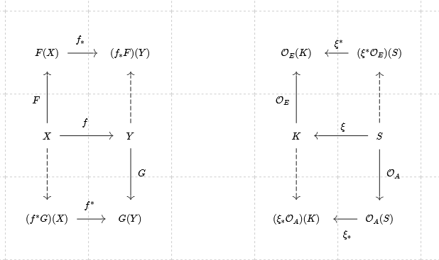

## reorder:
# inclusion & equiv can be done as O_E->O_H 
# equiv can then be used to introduce O_A which is the constraint on O_H
# bundles: 
## data: 
* $(E, K, \pi, F)$
* sections: $\{\tau: k \rightarrow r \mid k \in K, r \in F\} \coloneqq \Gamma(K, E)$
* sheaf: $\mathcal{O}_E: U \rightarrow \Gamma(U, E)$, $U \subset K$

## visual?:
* $(V, K, \pi, P)$
* sections: $\{\mu: k \rightarrow p \mid k \in K, p \in P\} \coloneqq \Gamma(K, V)$
* sheaf: $\mathcal{O}_V: U \rightarrow \Gamma(U, V)$, $U \subset K$

## graphic
* $(H, S, \pi, D)$
* sections: $\{\rho: (s_x, s_y) \rightarrow d \mid (s_x, s_y) \in S, d \in D\} \coloneqq \Gamma(S, H)$
* sheaf all: $\mathcal{O}_H: W \rightarrow \Gamma(W, H)$, $W \subset S$
* reachable sheaf: $\mathcal{O}_A: W \rightarrow A(\mathcal{O}_E)$

## Artist

* morphism: $S \xrightarrow{\xi} K$, $U \subset K, W \subset S$
* $\mathcal{O}_E: U \rightarrow \{\tau: k \rightarrow r \mid k \in K, r \in F\}$, $k \in U \subset K$
* $\mathcal{O}_A: W \rightarrow \{\rho: s \rightarrow d \mid \rho(s) \in A(\tau(k)), \tau \in \mathcal{O}_E, \xi(s)=k\}$
* NOTE: $\mathcal{O}_{A}$ is defined circularly

### sheaf pullback/pushforwards
* morphism: $S \xrightarrow{\xi} K$
* pushforward $\mathcal{O}_A(S) \xrightarrow{ \xi_*} (\xi_*\mathcal{O}_A)(K)$
  
    $\{\rho: s \rightarrow d \mid s \in S, d \in D\} \xrightarrow{\xi_*} \{\rho: \xi^{-1}[k] \rightarrow d \mid \xi^{-1}(k)\subset S\}$  

* pullback: $(\xi^*\mathcal{O}_E)(S) \xrightarrow{\xi^*} \mathcal{O}_E(K)\}$
  
    $\{\tau: \xi(s) \rightarrow r \mid \xi(s) \in K, r \in F\}\xrightarrow{\xi^*}\{\tau: \xi \rightarrow r \mid k \in K, r \in F\}$

    

### $\varphi$
- seperate constraint->diagram must commute, not a fall out of construction
- consistency condition eg 21 in paper
  - if A(\tau) = A(\tau^prime), then A(\varphi \tau) = A(\varphi \tau^{\prime})

### union
$Q(\Gamma(U_i, V|_{U_i})) = \Gamma(W_i, H|_{W_i})$

propose:

$\sqcup Q_i(\Gamma(U_i, V_i|_{U_i})) = \sqcup \Gamma(W_i, H|_{W_i})$

given:

$\Gamma(W_i, H|_{W_i}) = \Gamma(\sqcup W_i, H|_{W_i})$

propose:

$\Gamma(\sqcup W_i, H|_{W_i}) \implies Q(\sqcup U_i, V_i|_{U_i})$

therefore:

$Q(\sqcup U_i, V_i|_{U_i}) = \sqcup Q_i(\Gamma(U_i, V_i|_{U_i}))$

\subsubsection{Combining \vmarkc's}
A set of $\vmarkc$ functions that output graphic sections, as introduced in \autoref{eq:atct:fb_graphic_section}, that go to the same space, for example to the same figure in a screen, are returning a set of functions into the same total bundle $\gtotal$;
\begin{equation}
  \label{eq:construction:qc1}
  \bigsqcup_i \vmark_i(\Gamma(\openset_i,\dtotal_i\restriction_{\openset_i})) = \bigsqcup_i \Gamma(\opensetg_i, \gtotal\restriction_{\opensetg_i})
\end{equation}
A property of hom-sets is that $Hom(W_i,H) + Hom(W_j,H) = Hom(W_i+W_j,H)$, which means that the union of hom-sets with the same target is equal to the hom-set of the union of sources to the target; therefore
\begin{equation}
  \label{eq:construction:qc2}
  \bigsqcup_i\Gamma(\opensetg_i, \gtotal\restriction_{\opensetg_i}) = \Gamma(\mathop{\sqcup}_{i}\opensetg_i, \gtotal\restriction_{{\mathop{\sqcup}_i}\opensetg_i})
\end{equation}
the union of sets of functions that generate parts of an image is equal to a set of functions that can generate the whole image. This implies that we can define a $\vmarkc$ that generates the set of sections over the whole image 
\begin{equation}
  \label{eq:construction:qc3}
\Gamma(\mathop{\sqcup}_i\opensetg_i, \gtotal\restriction_{\mathop{\sqcup}_{i}\opensetg_i}) \implies \vmark(\mathop{\sqcup}_{i}\Gamma(\openset_i,\vtotal_i\restriction_{\openset_i}) 
\end{equation}
which means that, following from \autoref{eq:constrution:qc1} and \autoref{eq:construction:qc3},
\begin{equation}
  \label{eq:construction:qc4}
  \vmarkc(\mathop{\sqcup}_{i}\cgamma{\opensetc_i}{\vtotalc_i\restriction_{\opensetc_i}}) =   
  \bigsqcup_i \vmarkc_i(\cgamma{\opensetc_i}{\vtotalc_i\restriction_{\opensetc_i}})
\end{equation}
we can construct a $\vmarkc = \sqcup_i\vmarkc_i$. This allows us to . 

\begin{figure}
  \label{fig:construction:combined_q}
  \includegraphics[width=1\colunwidth]{qsketchh.png}
  \caption{}
\end{figure}

As illustrated in \autoref{fig:construction:combined_q}, this composition rule expresses the construction of a multipart circle-square graphic out of circles and squares produced by different $\vmarkc$. \note{rewrite:Also figures are the unions of their parts}.