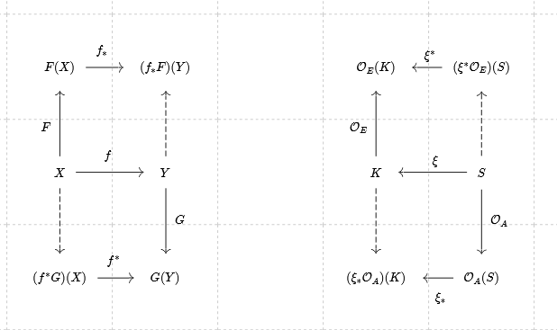

\subsection{Structure Preservation}
\begin{figure}[H]
  \includegraphics[width=1\columnwidth]{k_different_types.pdf}
  \caption{This weather station data has multiple embedded continuities - points at each time and position, timeseries at each position, and maps at each time. The corresponding visualizations - bar chart, timeseries, and map - each preserve the continuity of the subset of the data they visualize by not introducing or leaving out values and preserving the relative positioning of continuous values.}
  \label{fig:related-work:continuity:ktypes}
\end{figure}

Generally, preserving structure means that a visualization is expected to preserve the $field$ properties and $connectivity$ of the corresponding dataset:

\begin{description}
  \item[\textcolor{fiber}{\textbf{field}}]\footnote{In this paper, color in definitions, equations, and visualizations is used to group conceptually related terms\cite{headMathAugmentationHow2022}, for example \textcolor{fiber}{field} and \textcolor{fiber}{fiber}.} is a set of values of the same type, e.g. the date, location, stations, and precipitation in \autoref{fig:related-work:continuity:ktypes}. 
  \item[\textcolor{base}{\textbf{connectivity}}] is how elements are arranged in a dataset\cite{wilkinsonGrammarGraphics2005}, for example as 0D ($\bullet$) points, along a 1D (--) line, in a 2D ($\blacksquare$) surface, as a 3D cube, or all of the above as in \autoref{fig:related-work:continuity:ktypes}.
\end{description}

To encode connectivity and field structure in a way that is both uniform and generalizable, we extend Butler's work on using a mathematical structure called fiber bundles as an abstract data representation in visualization \cite{butlerVectorBundleClassesForm1992, butlerVisualizationModelBased1989}. We sketch out fiber bundles in \autoref{sec:atct:fiber-bundles}, but Butler provides a thorough introduction to bundles for visualization practitioners. 

\note{Move most of this to topology}

semantic indexing as described by Munzner's key-value model of data structure \cite{munznerWhatDataAbstraction2014} act as different ways of partitioning the underlying data continuity. 

For example, the data cube in \autoref{fig:related-work:continuity:ktypes} could be subset into sets of timeseries where the key would be $station$, or subset into maps where the key would be $date$, or subset into station records where the keys are $(date, latitude, longitude)$. Using a connectivity model rather than semantic indexing also makes clearer when different labeling schemes refer to the same point, for example how 0-360 and 180E-180W are two ways of labeling longitude or how (date, lat, lon) and (date, station) refer to the same point. 
\note{generalization, also use to lead into homemomorphism}
This is in contrast to Wilkinson modeling the continuity as metric spaces\cite{wilkinsonGrammarGraphics2005} such that a distance function is a fixed property of the continuity; in our model it distance is a property of a field over that continuity. 

\subsubsection{Homemomorphism}
\label{sec:related-work:continuity}
Visual algorithms are assumed to preserve the underlying continuity of their input data, as described in taxonomies of visualization algorithms Chi\cite{chiTaxonomyVisualizationTechniques2000} and by Troy and M\"{o}ller \cite{toryRethinkingVisualizationHighlevel2004}, and codified by 

but generally do not verify that input structure. 

% move 
For example, a \texttt{line} algorithm often does not have a way to query whether a list of (x,y) coordinates is the distinct rows, the time series, or the list of stations in \autoref{fig:related-work:continuity:ktypes}. While plotting the time series as a continuous line would be correct, it would be incorrect for a visualization to indicate that the distinct rows or stations are connected in a 1D continuous manner because it introduces ambiguity over which part of the line maps back to the data. This 

This ambiguity cannot exist when the map between data and graphic is a homeomorphism:
\begin{definition}]\cite{wilkinsonGrammarGraphics2005}
  A function $f$ is a \textit{homeomorphism} if $f$ is a continuous bijective function and its inverse function $f^{-1}$ is also continuous.
\end{definition}
which means that every element of the graphic maps back to a data element. The bar plot, line plot, and heatmap in \autoref{fig:related-work:continuity:ktypes} have a homeomorphic relationship to the 0D, 1D, and 2D ($\blacksquare$) connectivity's embedded in the continuous 3 dimensional indexing space; each point of the visualization maps back into a point in its corresponding indexing space in the cube. Using homeomorphism to test whether continuity is preserved formalizes Bertin's codification of how the topology of observations matches the class of representation (i.e. point , line, area) \cite{bertinSemiologyGraphicsDiagrams2011} and Wilkinson's assertion that connectivity must be preserved \cite{wilkinsonGrammarGraphics2005}. Wilkinson \cite{wilkinsonGrammarGraphics2005} objected to using homeomorphism as a test for structural equality because some common visualizations are not homemorphic (for example, no continuous map exists between a plane and a sphere), but the fiber bundle abstraction provides a method for subdividing spaces such that a homemorphism can be constructed. 
\subsubsection{Equivariance}
\begin{figure}[H]
  \includegraphics[width=1\columnwidth]{actions.pdf}
  \caption{}
  \label{fig:related-work:field-preservation}
\end{figure}

Data is often described by its mathematical structure, for example the Steven's measurement scales define nominal, ordinal, interval, and ratio data by the transformations allowed on the data \cite{stevensTheoryScalesMeasurement1946}. Other researchers have since expanded the scales to encapsulate more types of structure \cite{leaFormalizationMeasurementScale1971, thomasMathematizationNotMeasurement2014}, and in \autoref{sec:atct:fb:fiber} we generalize further by proposing that data can be encoded as mathematical categories.

Loosely, structure is defined as a collection of values $X$ and transformations $G$ on those values. These transformations can be operations, relations, or generalized as actions:
\begin{definition}\label{def:related-work:action}
  An \textcolor{action}{\textbf{action}} is a function  $act: \textcolor{action}{G} \times X \rightarrow X$. An action has the properties of identity $act(\textcolor{action}{e}, x) = x$ for all  $x \in X$ and associativity $act(\textcolor{action}{g}, act(\textcolor{action}{f}, x)) = act(\textcolor{action}{f} \circ \textcolor{action}{g}, x)$ for $\textcolor{action}{f},\textcolor{action}{g} \in \textcolor{action}{G}$.\cite{grimaldiDiscreteCombinatorialMathematics2006}
\end{definition}
Elements of $X$ can be from one data field or all of them or some subset; similarly the actions act on the elements of $X$ and each action can be a composition of actions.

A function that preserves structure when the input or output is changed by a group\footnote{A mathematical {group} is a set with an associative binary operator. This operation must have an identity element and be closed, associative, and invertible, consisting of a set of values $X$ and \textcolor{action}{actions} on the set {$G = (G,\circ, e)$}.} action is called \textit{equivariant}.  Given a group $G$ that acts on both $X$ and $Y$, 
\begin{definition}\label{def:equivariance}
 a function $f: X \rightarrow Y$ is \textbf{equivariant} when $f(act(g,x)) = act(g,f(x))$ for all $g$ in $G$ and for all $x$ in $X$ \cite{pittsNominalSetsNames2013}
\end{definition}
This means that a visualization is structure preserving when there exist compatible group actions on the data and visualization, as proposed by Kindlemann and Scheidegger\cite{kindlmannAlgebraicProcessVisualization2014}. 

Although the Steven's scales were conceptualized as having group structure, the ordinal scale has a monoidal structure because partial orders ($\geq, \leq$) are not invertible. This means \textit{equivariance} cannot be used to test for structure preservation; instead \textit{homomorphism} can be used. Given the function $f: X \rightarrow Y$, with operators $(X, \circ)$ and $(Y, *)$
\begin{definition}\label{def:homomorphism}
  A function $f$ is \textbf{homomorphic} when $f(x_1 \circ x_2) = f(x_1) * f(x_2)$ and preserves identities $f(I_x) = I_y$ for all $x, y \in X$ \cite{grimaldiDiscreteCombinatorialMathematics2006}
\end{definition}
This means that a visualization is structure preserving when there
exists compatible operators (here $\circ$ and $*$) such that the relations between data elements is preserved in the mapping, 
as proposed by Mackinlay\cite{mackinlayAutomaticDesignGraphical1987}.

As illustrated in \autoref{fig:related-work:field-preservation}, a visualization is structure preserving when the functions commute such that the graphic is the same whether the data is acted on ($
\dfunct$) and then mapped ($A$) to a graphic or whether the data is mapped to a graphic that is then modified in a compatible way. As shown in \autoref{fig:related-work:field-preservation}, a function can be homomorphic but not equivariant, such as an exponential encoding, or equivariant but not homomorphic, such as the inverse encoding. As shown, a function can also be homomorphic (or equivariant) with respect to one action but not with respect to another. We generalize the expectation of commutativity to codify structure preservation in \autoref{sec:artist:equivariant:data}.

## reorder:
# inclusion & equiv can be done as O_E->O_H
# equiv can then be used to introduce O_A which is the constraint on O_H
# bundles:
## data:
* $(E, K, \pi, F)$
* sections: $\{\tau: k \rightarrow r \mid k \in K, r \in F\} \coloneqq \Gamma(K, E)$
* sheaf: $\mathcal{O}_E: U \rightarrow \Gamma(U, E)$, $U \subset K$

## visual?:
* $(V, K, \pi, P)$
* sections: $\{\mu: k \rightarrow p \mid k \in K, p \in P\} \coloneqq \Gamma(K, V)$
* sheaf: $\mathcal{O}_V: U \rightarrow \Gamma(U, V)$, $U \subset K$

## graphic
* $(H, S, \pi, D)$
* sections: $\{\rho: (s_x, s_y) \rightarrow d \mid (s_x, s_y) \in S, d \in D\} \coloneqq \Gamma(S, H)$
* sheaf all: $\mathcal{O}_H: W \rightarrow \Gamma(W, H)$, $W \subset S$
* reachable sheaf: $\mathcal{O}_A: W \rightarrow A(\mathcal{O}_E)$

## Artist

* morphism: $S \xrightarrow{\xi} K$, $U \subset K, W \subset S$
* $\mathcal{O}_E: U \rightarrow \{\tau: k \rightarrow r \mid k \in K, r \in F\}$, $k \in U \subset K$
* $\mathcal{O}_A: W \rightarrow \{\rho: s \rightarrow d \mid \rho(s) \in A(\tau(k)), \tau \in \mathcal{O}_E, \xi(s)=k\}$
* NOTE: $\mathcal{O}_{A}$ is defined circularly

### sheaf pullback/pushforwards
* morphism: $S \xrightarrow{\xi} K$
* pushforward $\mathcal{O}_A(S) \xrightarrow{ \xi_*} (\xi_*\mathcal{O}_A)(K)$

    $\{\rho: s \rightarrow d \mid s \in S, d \in D\} \xrightarrow{\xi_*} \{\rho: \xi^{-1}[k] \rightarrow d \mid \xi^{-1}(k)\subset S\}$

* pullback: $(\xi^*\mathcal{O}_E)(S) \xrightarrow{\xi^*} \mathcal{O}_E(K)\}$

    $\{\tau: \xi(s) \rightarrow r \mid \xi(s) \in K, r \in F\}\xrightarrow{\xi^*}\{\tau: \xi \rightarrow r \mid k \in K, r \in F\}$

    

### $\varphi$
- seperate constraint->diagram must commute, not a fall out of construction
- consistency condition eg 21 in paper
  - if A(\tau) = A(\tau^prime), then A(\varphi \tau) = A(\varphi \tau^{\prime})

### union
$Q(\Gamma(U_i, V|_{U_i})) = \Gamma(W_i, H|_{W_i})$

propose:

$\sqcup Q_i(\Gamma(U_i, V_i|_{U_i})) = \sqcup \Gamma(W_i, H|_{W_i})$

given:

$\Gamma(W_i, H|_{W_i}) = \Gamma(\sqcup W_i, H|_{W_i})$

propose:

$\Gamma(\sqcup W_i, H|_{W_i}) \implies Q(\sqcup U_i, V_i|_{U_i})$

therefore:

$Q(\sqcup U_i, V_i|_{U_i}) = \sqcup Q_i(\Gamma(U_i, V_i|_{U_i}))$

\subsubsection{Combining \vmarkc's}
A set of $\vmarkc$ functions that output graphic sections, as introduced in \autoref{eq:atct:fb_graphic_section}, that go to the same space, for example to the same figure in a screen, are returning a set of functions into the same total bundle $\gtotal$;
\begin{equation}
  \label{eq:construction:qc1}
  \bigsqcup_i \vmark_i(\Gamma(\openset_i,\dtotal_i\restriction_{\openset_i})) = \bigsqcup_i \Gamma(\opensetg_i, \gtotal\restriction_{\opensetg_i})
\end{equation}
A property of hom-sets is that $Hom(W_i,H) + Hom(W_j,H) = Hom(W_i+W_j,H)$, which means that the union of hom-sets with the same target is equal to the hom-set of the union of sources to the target; therefore
\begin{equation}
  \label{eq:construction:qc2}
  \bigsqcup_i\Gamma(\opensetg_i, \gtotal\restriction_{\opensetg_i}) = \Gamma(\mathop{\sqcup}_{i}\opensetg_i, \gtotal\restriction_{{\mathop{\sqcup}_i}\opensetg_i})
\end{equation}
the union of sets of functions that generate parts of an image is equal to a set of functions that can generate the whole image. This implies that we can define a $\vmarkc$ that generates the set of sections over the whole image
\begin{equation}
  \label{eq:construction:qc3}
\Gamma(\mathop{\sqcup}_i\opensetg_i, \gtotal\restriction_{\mathop{\sqcup}_{i}\opensetg_i}) \implies \vmark(\mathop{\sqcup}_{i}\Gamma(\openset_i,\vtotal_i\restriction_{\openset_i})
\end{equation}
which means that, following from \autoref{eq:constrution:qc1} and \autoref{eq:construction:qc3},
\begin{equation}
  \label{eq:construction:qc4}
  \vmarkc(\mathop{\sqcup}_{i}\cgamma{\opensetc_i}{\vtotalc_i\restriction_{\opensetc_i}}) =
  \bigsqcup_i \vmarkc_i(\cgamma{\opensetc_i}{\vtotalc_i\restriction_{\opensetc_i}})
\end{equation}
we can construct a $\vmarkc = \sqcup_i\vmarkc_i$. This allows us to .

\begin{figure}
  \label{fig:construction:combined_q}
  \includegraphics[width=1\colunwidth]{qsketchh.png}
  \caption{}
\end{figure}

As illustrated in \autoref{fig:construction:combined_q}, this composition rule expresses the construction of a multipart circle-square graphic out of circles and squares produced by different $\vmarkc$. \note{rewrite:Also figures are the unions of their parts}.

\begin{figure}[h!]
  \label{fig:construction:flow}
  \includegraphics*[width=1\columnwidth]{path_of_q.png}
  \caption{One method of constructing the artist is by formulating the artist as having two stages: (1) encoding functions $\vchannelc$ that convert different parts of the input into measurable visual components, such as color or position; (2) compositing functions $\vmarkc$ that assemble the measurable visual components into a visual element generating function. In this construction, we propose an intermediate visual bundle $\vtotalc$ that encodes the space of possible visual encodings.}
\end{figure}

## intro

and use the concepts of \textit{homomorphism} and \textit{equivariance} to express how that structure should be preserved. Structure is considered preserved when the input and output change in tandem, and these symmetries are often modeled as \textit{group actions}, which are a way for a group\footnote{A \textit{group} is a set with an associative binary operator, an identity, and an inverse operation} to transform some other set:

 instead

 \begin{definition}
\note{must sort out exact appropriate definition of group homomorphism here}
 \end{definition}

The notion that visual encoding functions should be \textit{homomorphisms} was in his specification of \textit{A Presentation Tool} and the idea that visual transforms are \textit{equivariant} underlies

We define structure preservation both in \note{field types and topology}

For example, the GHCN\cite{lawrimoreGlobalHistoricalClimatology2011} dataset in \autoref{fig:related-work:continuity:ktypes} is a complex spatiotemporal record of weather station data. One way of encoding that each record is independent is to encode the underlying topology as a set of 0D $\cdots$ points, one for each record. Each of these discrete points is also represented visually as a discrete marker in the scatter plot. We can view the time series at each station as a 1D $-$ continuous line since weather station data is sampled from natural phenomena. We encode this topological structure as intervals, .i.e [start date, end date], and sets of sub-intervals, and we visually represent this structure as continuous line plots. A third way of viewing the data is as a sparse sampling of a 2D $\blacksquare$ geospatial grid, where the connectivity is modeled as a surface and sub regions of that surface. In the visualization, that connectivity is expressed as plotting the stations in the map, visually denoting that these are points in the continuous geographical space that is New York State.

In \autoref{sec:atct:sheaves}, the functors $\vindex, \vindexpull, \vindexpushc$ are introduced to codify the expectation that every element

The functor

\begin{equation*}
  \begin{tikzcd}
    & {} \arrow[dd, "\texttt{artist}" description, Rightarrow,  shorten <= .85em, shorten >= .85em, color=artist, font=\Huge]
    & \\ {\scriptstyle\textcolor{base}{\texttt{topology}}}
      \arrow[rr, "\texttt{graphic}"', bend right, color=section, font=\huge] \arrow[rr, "\texttt{dataset}", bend left, color=section, font=\huge] &
    & {\scriptstyle\textcolor{base}{\texttt{topology}}\textcolor{section}{\rightarrow} \textcolor{fiber}{\texttt{fields}}} \\
    & {}                                              &
\end{tikzcd}
\end{equation*}

add note in presheafs about how we're showing inclusion but presheaf contracts include all morphisms between base spaces, is the entire space: